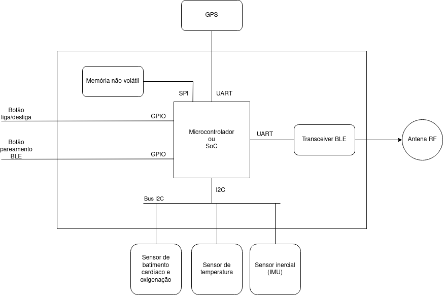

# `AUssistente`
# `Pet Care Assistant`

## Apresentação

O presente projeto foi originado no contexto das atividades da disciplina de graduação *EA075 - Introdução ao Projeto de Sistemas Embarcados*, 
oferecida no segundo semestre de 2023, na Unicamp, sob supervisão da Profa. Dra. Paula Dornhofer Paro Costa, do Departamento de Engenharia de Computação e Automação (DCA) da Faculdade de Engenharia Elétrica e de Computação (FEEC).

## Integrantes

|Nome  | RA | Curso|
|--|--|--|
| Betania Eugenia Rodrigues da Silva  | 167508  | Eng. Elétrica|
| Vinícius de Oliveira Peixoto Rodrigues  | 245294  | Eng. de Computação |


## Descrição do Projeto
> Descrição do objetivo principal do projeto, incluindo contexto gerador, motivação.

O objetivo do presente projeto é desenvolver um sistema que auxilie os donos de animais de estimação, com foco em cães e gatos, a facilitar o monitoramento da saúde de seus pets em tempo real. Esta iniciativa surge em resposta à crescente demanda por cuidados mais especializados e personalizados para nossos queridos animais de estimação, que estão cada vez mais integrados à vida familiar. O sistema atuará como um 'companheiro canino e felino inteligente', oferecendo uma solução completa para monitorar e melhorar o bem-estar de nossos bichinhos, garantindo que eles desfrutem de uma vida feliz e saudável ao nosso lado.

> Qual problema vocês pretendem solucionar?

Nosso projeto tem como objetivo resolver diversos desafios enfrentados pelos donos de animais de estimação. O primeiro grande problema a ser abordado é a perda de animais de estimação quando eles escapam, o que é uma preocupação frequente para muitos proprietários. Para resolver essa questão, haverá um sistema de geolocalização que permite localizar os animais rapidamente, facilitando o reencontro com seus donos.

Além disso, nosso sistema visa melhorar o cuidado com a saúde dos animais de estimação de maneira mais abrangente. Ele monitorará constantemente os batimentos cardíacos dos animais e notificará os proprietários se os batimentos cardíacos saírem do normal, permitindo uma resposta rápida em caso de problemas de saúde. Além do mais, o sistema será capaz de aferir o sono e o padrão de alimentação dos animais, o que ajuda os donos a garantir que seus bichinhos tenham um estilo de vida saudável. Isso não só aumenta a qualidade de vida dos animais de estimação, mas também antecipa possíveis agravantes para sua saúde, permitindo intervenções precoces quando necessário.

> Quem são os potenciais usuários?
 
Donos de animais de estimação em um geral.
 
> É possível estabelecer um valor econômico associado?

Sim, é possível, mas primeiramente é necessário realizar um levantamento dos componentes a serem utilizados.


## Descrição Funcional

### Funcionalidades
- Rastreamento de GPS
- Comunicação via BLE/rede sem fio
- Monitoramento de batimentos cardíacos e oxigenação sanguínea
- Acompanhamento dos Níveis de Atividades
- Aferição de Hábitos Diários como frequência e nutrição das refeições e padrões de sono
- Alertas de saída da área pré determinada pelo dono
- Alertas de temperatura corporal do pet
- Análise dos dados diários através gráficos para melhor entendimento do dono

### Configurabilidade

- Pareamento BLE: o dispositivo pode ser configurado por meio de um botão para se conectar a um dispositivo (smartphone, assistente virtual, etc.) por Bluetooth para transmitir dados
- Perfil de energia: o modo de funcionamento do dispositivo pode ser configurado de modo a controlar o consumo de energia, prolongando assim o tempo de atividade antes de ser necessário carregar o aparelho

### Eventos
- Ativação do botão de ligar/desligar
- Leitura de sensores (feitas por meio de interrupção de hardware): os sensores serão configurados para, em intervalos regulares, reportarem para o microcontrolador os valores medidos. Estimativa dos intervalos de leituras:
    - Sensor inercial (IMU): entre 200ms e 2s
    - Sensor de batimentos cardíacos/oxigenação sanguínea: entre 1s e 10s
    - Sensor de temperatura: entre 15s e 1m
    - Sensor de nível de bateria: entre 15s e 1m
    - GPS: entre 15s e 1m
- Ativação do botão de pareamento BLE
- Requisição recebida por BLE
- Valores críticos de batimento cardíaco/oxigenação/temperatura
- Fuga do pet (saída da área pré-determinada pelo dono)
- Nível crítico de bateria

### Tratamento de Eventos
- Ativação do botão de ligar/desligar
    - Dispositivo desligado ou em _deep sleep_: carrega dados de configuração da memória flash ou da SRAM, realiza o boot e o bringup dos componentes
    - Dispositivo ativo ou _idle_: realiza a rotina de shutdown, escrevendo dados relevantes na memória não-volátil e desligando a placa

- Leitura de sensores: armazena os dados em um buffer circular na memória RAM
    - Caso o buffer circular esteja cheio: armazena os dados na SRAM ou na memória não-volátil

- Ativação do botão de pareamento BLE: executa a rotina de pareamento para se conectar ao smartphone

- Requisição recebida por BLE/rede sem fio: invoca a rotina adequada para responder à requisição de maneira assíncrona (sem interromper o fluxo de leitura de sensores)

- Valores críticos de batimento cardíaco/oxigenação/temperatura e fuga de pet: toca um aviso sonoro e envia uma mensagem de alerta para o dispositivo conectado por Bluetooth/rede wireless (caso haja um)

- Nível crítico de bateria: envia uma mensagem de alerta para o dispositivo conectado por Bluetooth, escreve dados relevantes na SRAM, desativa os sensores e entra em _deep sleep_

## Descrição Estrutural do Sistema



## Especificações

### Especificação Estrutural

#### Tabela de componentes
| Componente    | Descrição | Funcionalidades | Interface de comunicação | Datasheet |
| ----------    | --------- |    ---------    |         ---------        |  -------  |
| ESP32-U4WDH   | Microcontrolador | Wi-Fi + BLE; excelente gerenciamento de energia; suporte a UART/I2C/SPI; memória flash SPI de 4MB integrada | - | [esp32.pdf](datasheets/esp32.pdf) |
| TMP117        | Sensor digital de temperatura | Alta precisão + baixo consumo de energia| I2C | [tmp117.pdf](datasheets;tmp117.pdf) |
| MAX30102      | Oxímetro + sensor de batimentos | Baixo consumo de energia, resistência a estresse mecânico | I2C | [max30102.pdf](datasheets/max30102.pdf) |
| MAX17043      | Medidor de carga de bateria | Baixo consumo de energia, alta precisão de medição | I2C | [max17043.pdf](datasheets/max17043.pdf) |
| BMI270        | Unidade de medida inercial (IMU) de 6 eixos | Baixo consumo de energia; correção de erro integrada em hardware | I2C/SPI | [bmi270.pdf](datasheets/bmi270.pdf) |
| MAX-M10S      | GPS | Baixo consumo de energia, alta precisão, monitoramento contínuo de geoposicionamento | UART/I2C | [max-m10s.pdf](datasheets/max-ma10s.pdf)

#### Características de operação

| Parâmetro | Min. | Típico | Máx. | Unidade |
| --------  |  --  |  --  | ------ |  -----  |
| Tensão de alimentação | 3.0 | 3.3 | 3.6 | V |
| Capacidade de corrente da bateria | 0.5 | - | - | A |
| Temperatura | -30 | - | 125 | °C |


#### Limites absolutos de operação

Estresse acima dos limites da tabela abaixo podem causar dano permanente ao dispositivo.

| Parâmetro | Min. | Máx. | Unidade |
| --------  |  --  |  --  |  -----  |
| Tensão de entrada | -0.3  | 3.6 | V |
| Corrente | - | 1200 | mA |
| Temperatura | -50 | 150 | °C |
| Impacto mecânico | - | 20000 | g |
| Queda livre sobre superfícies rígidas | - | 1.8 | m |


#### Interfaces de periféricos planejadas

Será necessário projetar um barramento I2C com características elétricas adequadas, seguindo as recomendações
da [especificação oficial](https://www.nxp.com/docs/en/user-guide/UM10204.pdf) do protocolo, no qual os periféricos
serão conectados de modo a atuar como targets, com a MCU assumindo o papel de controller.

Será necessário também projetar um _buzzer_ piezoelétrico de modo a tocar os alertas sonoros especificados nos algoritmos
de tratamento de eventos.

### Especificação de Algoritmos 

Para podermos tratar os eventos decorrentes do sistema do AUssistente, desenvolvemos o seguinte algoritmo em pseudocódigo.

```text
AUssistente;
timer_sensor_inercial;
timer_sensor_batimento;
timer_sensor_temperatura;
timer_sensor_bateria;
timer_gps;
buffer_circular;

função principal():
  em caso de evento:
		  processar_evento(evento)

função processar_evento(evento):
  caso evento == evento.botao_ligar:
		  se AUssistente.estado == estado.desligado || AUssistente.estado == estado.hibernar:
      configs = carregar_dados_configuracao( )
      inicializar_componentes(configs)

  senão, se AUssistente.estado == estado.ativo || AUssistente.estado == estado.ocioso:
    salvar_dados( )
    desligar_placa( )

  caso evento == evento.leitura_sensor:
		  dados = ler_sensor(evento.enum_sensor)
    se buffer_circular está cheio:
      salvar_memoria(dados)
		  senão:
      buffer_circular[dados.enum_sensor].proximo(dados.info)

  caso evento == evento.pareamento:
    AUssistente.dispositivo = parear( )

  caso evento == evento.requisicao:
    tratar_requisicao(evento.requisicao)

  caso evento == evento.valores_criticos:
    tocar_aviso_sonoro(evento.valor)
    enviar_mensagem_dispositivo(evento.valor)

  caso evento == evento.bateria_critica:
    enviar_alerta_bateria( )
    salvar_dados( )
    desativar_sensores( )
    hibernar( )

  caso default:
    emitir_erro_evento()

função carregar_dados_configuracao():
  configs = ler_arquivo(caminho_arquivo)
  retornar configs

função inicializar_componentes(configs):
  AUssistente = novo AUssistente;
  novo buffer_circular = [5][configs[tamBuffer]]
  AUssistente.perfil_energia = configs[pEnergia]
  AUssistente.ultimo_dispositivo = configs[ultimoDispositivoConectado]
  AUssistente.sensores_ativos = true
  timer_gps = configs[tGPS] ? configs[tGPS] : 30s
  timer_sensor_bateria = configs[tBateria] ? configs[tBateria] : 30s
  timer_sensor_batimento = configs[tBatimento] ? configs[tBatimento] : 5s
  timer_sensor_inercial = configs[tIMU] ? configs[tIMU] : 1s
  timer_sensor_temperatura = configs[tTemperatura] ? configs[tTemperatura] : 30s
  AUssistente.dispositivo = parear(AUssistente.ultimo_dispositivo)

função salvar_dados():
  escrever(caminho_arquivo, AUssistente, buffer_circular)

função desligar_placa():
  power_off_mode()

função ler_sensor(sensor_id):
  retornar pegar_leitura_sensor(sensor_id)

função salvar_memoria(dados):
  EEPROM.write(dados);

função parear(dispositivo):
  BTSerial.begin(dispositivo.serial)
  sucesso = BTSerial.available()
	 retornar sucesso ? dispositivo : null

função parear():
  device = BTSerial.emparelhar()
	 retornar device

função tratar_requisicao(requisicao):
	 caso requisicao == requisicao.1:
		  tratamento_1()
	 caso requisicao == requisicao.2:
		  tratamento_2()
	 caso default:
		  tratamento_default()

função tocar_aviso_sonoro(tipo):
	 tone(buzzer_pin, tipo * 800)
	 delay(15000)
	 noTone(buzzer_pin)

função enviar_mensagem_dispositivo(tipo):
	 BTSerial.write("Atenção: O " + tipo + " está com valores criticos!")

função enviar_alerta_bateria():
	 BTSerial.write("Atenção: Bateria do AUssistente em niveis criticos, entrando em hibernação...")

função desativar_sensores():
	 AUssistente.sensores_ativos = false

função hibernar():
	 power_save_mode()

```

## Referências (ATUALIZAR SE NECESSÁRIO)
- Especificação do protocolo I2C https://www.nxp.com/docs/en/user-guide/UM10204.pdf
- Cálculos de valores de resistência em barramentos I2C https://www.allaboutcircuits.com/technical-articles/the-i2c-bus-hardware-implementation-details/
- Design de buzzers piezoelétricos https://www.diodes.com/assets/App-Note-Files/Design-Considerations-for-Driving-Piezoelectric-Buzzers.pdf

