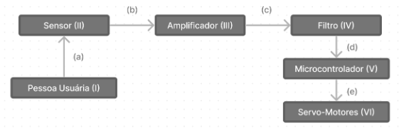
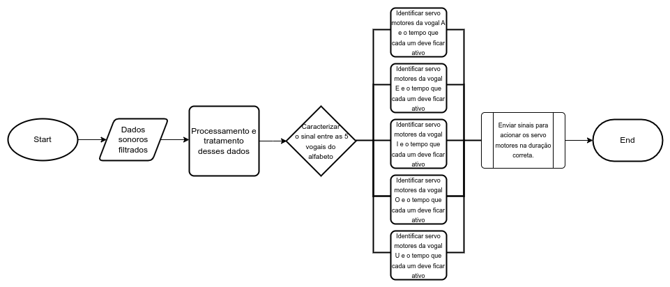

# `Alfabetização em Libras para crianças ouvintes`
# `Literacy in Libras for hearing children`

## Apresentação

O presente projeto foi originado no contexto das atividades da disciplina de graduação *EA075 - Introdução ao Projeto de Sistemas Embarcados*, 
oferecida no segundo semestre de 2023, na Unicamp, sob supervisão da Profa. Dra. Paula Dornhofer Paro Costa, do Departamento de Engenharia de Computação e Automação (DCA) da Faculdade de Engenharia Elétrica e de Computação (FEEC).

> |Nome  | RA | Curso|
> |--|--|--|
> | Beatriz Iamauchi Barroso  | 166531  | Ciência da Computação|
> | Emily Sayuri Morihiro  | 233880  | Ciência da Computação|

## Descrição do Projeto

O objetivo deste projeto é o ensino do alfabeto em libras para crianças ouvintes. Essa ideia surgiu durante um brainstorm entre a dupla do projeto, na qual uma das integrantes começou a estudar LIBRAS recentemente. Inicialmente, o foco do projeto seria voltado para a criação de um brinquedo para crianças, capaz de imitar falas e efetuar movimentos durante a reprodução, porém, complementamos a ideia a partir da integração da proposta de aprendizado voltada para a comunicação, em especial, a comunicação na Língua Brasileira de Sinais. Como motivadores, temos a notória dificuldade de aprender e memorizar sinais durante a fase adulta, processo que seria mais fácil e efetivo se realizado durante a infância. Assim, a ideia surgiu seguindo a mesma lógica da ideia anterior, criando assim um robô que se movimenta por comandos de voz.

Segundo dados do IBGE, 5% da população brasileira é composta por pessoas surdas, o que é um número relevante quando confrontado com o fato de o ensino de LIBRAS não ser parte da grade obrigatória das escolas nacionais. Esse projeto consiste em um brinquedo interativo que dado a fala de uma letra do alfabeto, o robô reproduz os movimentos do sinal em LIBRAS referente a palavra dita. Entendemos que esse projeto pode ser eficiente no que propõe pela interatividade e resposta física e imediata, o que facilita a visualização e entendimento dos sinais. No futuro, pensamos em uma possível expansão do projeto para abranger sinais mais complexos.

Dessa forma, o projeto foca na facilitação do aprendizado de LIBRAS, dado o problema visível de a maioria dos estudantes brasileiros se formarem sem saberem a língua, visto a despriorização do aprendizado por parte da rede pública de ensino no país.

O produto é pensado inicialmente para ser utilizado por crianças, porém, há também a possibilidade de ser utilizado por qualquer adulto que queira iniciar seu aprendizado em LIBRAS.

O valor econômico associado pode ser considerado inicialmente como a soma dos valores dos componentes e materiais necessários para a sua produção, além do custo de mão de obra para criação e testes.

## Descrição Funcional

### Funcionalidades

Dentre as tarefas que o sistema será capaz de executar, estão elencadas abaixo a/o:
* **Detecção de Voz ou Som:** Com o uso de um microfone, o robô é projetado para detectar quando uma pessoa está falando uma letra do alfabeto reconhecida por ele.
* **Identificação de palavras:** O robô deve conseguir, a partir de um som detectado, determinar qual letra foi dita.
* **Ativação/Desativação:** Tem a finalidade de iniciar/desligar o aparelho quando a pessoa usuária desejar, através do uso de botões.
* **Feedback Visual:** Com a classificação do som capturado, o brinquedo, que será em formato de uma mão, deverá modificar sua posição, dobrando seus dedos, a fim de mostrar o sinal de libras referente a letra dita. Assim, tornando a experiência mais envolvente.
* **Design Interativo:** Dados os itens acima, o design do brinquedo inclui movimentos físicos que respondem aos sons reproduzidos.
* **Alimentação:** O brinquedo deve ser alimentado por uma bateria para garantir o funcionamento de sua movimentação.

### Configurabilidade

O usuário não poderá alterar a configuração do brinquedo, uma vez que não foram identificados modos configuráveis relevantes para o seu funcionamento. A priori, não seria relevante para a construção do projeto a possibilidade de configurar o idioma a ser captado na fala da pessoa usuária, ou a velocidade com que os servo-motores realizariam o movimento para representar o sinal em LIBRAS, porém, consideramos tais ideias como futuras melhorias a serem adicionadas após a primeira versão do brinquedo.

### Eventos

O sistema deve tratar os eventos de ligar e desligar seu sistema a partir do uso de botões pelo usuário, quando ligado, capturar sons do ambiente, gerar um sinal a partir dessa captura, amplificar e filtrar o sinal (visando a adaptação do sinal para a faixa exigida pelos componentes de processamento diminuição de ruído), processar o sinal e identificar os sons relevantes para que a movimentação seja ativada, e por fim, de acordo com o resultado do processamento e através do movimento dos servo-motores, responder (realizando ou não a movimentação) com o sinal em libras correspondente a cada uma das letras do alfabeto.

Os eventos periódicos são dados com a captura do som do ambiente, no qual o brinquedo constantemente registra as ondas sonoras e processa o sinal originado, tentando identificar se alguma palavra reconhecida em seu sistema foi pronunciada para que o bloco de movimentação seja iniciado. Além disso, a amplificação e filtragem do sinal e também são eventos periódicos a serem realizados logo após a captura do som e anterior ao seu processamento.

Para os eventos não periódicos, temos a ativação (ligar) e desativação (desligar) do brinquedo, que depende da ação da pessoa usuária, e também a resposta com o sinal em libras, que por depender do processamento, é realizada a partir da capacidade do sistema reconhecer um som que ative os comandos de movimentação.

Acerca do tempo mínimo de processamento entre dois eventos sucessivos, em nosso projeto, ele é definido como o tempo de captura, amplificação, filtragem e processamento para o reconhecimento do sinal. Se a palavra gravada não for reconhecida em seu sistema, o brinquedo não deverá executar o bloco de movimentação, e portanto continuará captando sons do ambiente até que identifique um som que ative uma movimentação específica para a letra identificada.

### Tratamento de Eventos

Para o tratamento de eventos, considera-se que o sistema deve, a partir da captura do som, realizar o tratamento do sinal gerado para que o processamento seja iniciado, isto é, se por exemplo o sinal captado for fraco, ele deve ser alterado para que esteja em uma faixa adequada de acordo com os componentes utilizados no processamento.

Além disso, o processamento faz parte do tratamento de eventos, pois é através dele que as palavras capturadas serão reconhecidas. De acordo com a faixa de sinal capturada, o sistema deve ser capaz de identificar a palavra pronunciada e, de acordo com ela, ativar o respectivo comando de movimentação.

## Descrição Estrutural do Sistema

A descrição estrutural do sistema conta com um diagrama de blocos, no qual estão ilustrados os blocos funcionais (caixas retangulares) que compõem o sistema, juntamente com a sua respectiva síntese de funcionalidades e o relacionamento entre eles (representado por setas indicativas do fluxo de sinais). 

1. **Pessoa usuária:** é representada no diagrama como responsável pela emissão de ondas sonoras a serem captadas.
    **(a):** onda sonora emitida pela pessoa usuária.
2. **Sensor:** componente responsável pela captura de ondas sonoras do ambiente e conversão da onda sonora em sinais elétricos para o sistema.
    **(b):** sinal elétrico oriundo da captura de som.
3. **Amplificador:** responsável pelo ajuste do sinal gerado pelo sensor, com a finalidade de ajustar a onda sonora a níveis adequados para filtragem e processamento.
    **(c):** sinal amplificado.
4. **Filtro:** responsável pela remoção de ruído oriundo da captura de ondas sonoras do ambiente.
    **(d):** sinal filtrado.
5. **Microcontrolador:** componente responsável pelo processamento do sinal filtrado e acionamento dos servo-motores desejados do sistema.
    **(e):** sinal de acionamento.
6. **Servo-Motores:** componentes responsáveis pela realização do movimento desejado de acordo com o sinal identificado pelo microcontrolador.

## Especificações

### Especificação Estrutural
Para a especificação estrutural do projeto, inicialmente definimos os periféricos de entrada e saída, sendo eles:
- **Push button**: Botão para determinação do intervalo do sinal. Enquanto o botão estiver pressionado, o sinal sonoro será captado.
- **Sensor**: Microfone com amplificador no modelo MAX4466.
- **Filtro**: Após análise do circuito com o auxílio do PAD da disciplina, identificamos que não será necessária a utilização do filtro que faria conexão entre o sensor e o microcontrolador, dessa forma, esse componente não fará mais parte do circuito pois o sinal analógico emitido pelo sensor é diretamente compatível com a entrada analógica do microcontrolador.
- **Microcontrolador**: ESP32, com 2 pinos de entrada (Captação do som e resposta do Push Button) e 13 pinos de saída (dentro dos pinos do ESP32). Usaremos a técnica PWM para posicionar os servo motores corretamente. O microcontrolador conterá o algorítmo para análise do som e identificação dos micro servo motores a serem acionados, assim como as suas respectivas durações de ativação.
- **Conversor de nível lógico 3,3V-5V**: Conversor de Nivel Lógico 3.3V-5V Bidirecional 8 Canais - CNL8, 2 unidades, visto que temos 13 pinos de saída do microcontrolador. 
- **Servo motores**: 13 micro servo-motores 9G SG90, responsáveis pela movimentação das articulações da mão (1 no dedão e 3 nos demais dedos).
- **Fonte de alimentação**: 2 fontes de alimentação, uma de 3,3V (Para o microcontrolador e o sensor), e outra de 5V para os Micro Servo Motores.

#### Características elétricas
De acordo com os datasheets dos componentes selecionados acima, temos as seguintes especificações:
- microcontrolador (ESP32): voltagem recomendada é 3.3V (com intervalo entre 2.3 V e 3.6 V)
- sensor (MAX4466): voltagem recomendada é 3.3V (com intervalo entre 2.4V e 5.5V)
- micro servo motor (9G SG90): voltagem recomendada é 5V (com intervalo entre 4.9V e 6V)

#### Conexões
No caso da conexão entre sensor e microcontrolador, não será necessária a utilização de um circuito de interface, pois o microfone possui saída analógica, que poderá ser conectada à entrada analógica do microcontrolador para o processamento. Como a saída do sensor a entrada do ESP32 é analógica, assim como a saída do ESP32 e a entrada dos servo motores são digitais, não há necessidade de conversores.

#### Restrições físicas e ambientais
A respeito do limite mecânico do circuito integrado, imaginamos que a mão projetada deverá ter altura máxima de 25cm (base do punho até a ponta do dedo médio), largura máxima de 13cm (lateral do dedo mínimo até a lateral do polegar) e 4cm de profundidade máxima (“grossura” entre a palma da mão), assim, estimamos que o interior da palma da mão seja suficiente para comportar os componentes e circuitos integrados responsáveis pela interpretação e processamento do comando de voz, enquanto o interior de cada dedo seja suficiente para comportar os micro servo-motores responsáveis por efetuar o movimento das articulações que buscamos representar. Com estas dimensões buscamos manter a proporção adequada para a representação de uma mão.

#### Limite de dissipação térmica
Para a determinação do limite de dissipação térmica, o microcontrolador ESP32 possui temperatura típica de operação na faixa entre -40 e 125°C, enquanto isso, o sensor MAX4466 pode sofrer danos permanentes ao operar em temperaturas acima de 70°C, além de que a faixa de temperatura do micro servo-motor está definida entre 0°C e 55°C. Dessa forma, considerando todos os componentes do circuito, definimos que seu limite de dissipação térmica deve ser menor que o limite recomendado para os micro servo-motores, sendo estimadamente equivalente a 45°C, a fim de se manter as condições físicas ideais para o funcionamento adequado.

### Especificação de Algoritmos 

## Referências

COSTA, P. D. P. Notas de Aula. Em: UNICAMP, D. F. (Ed.). Introdução ao Projeto de Sistemas Embarcados. [s.l: s.n.].
COSTA, P. D. P. Introdução a Projetos. 2023. Disponível em: <https://docs.google.com/presentation/d/1afvy-OOdnNWq14U_VM_S1gdlB8W96pPzuXCWzTYaslg/edit#slide=id.p>
CENTRO UNIVERSITÁRIO DE BARRA MANSA, U. B. M. População brasileira é composta por mais de 10 milhões de pessoas surdas. Disponível em: <https://g1.globo.com/rj/sul-do-rio-costa-verde/especial-publicitario/ubm/conhecimento-transforma/noticia/2020/02/12/populacao-brasileira-e-composta-por-mais-de-10-milhoes-de-pessoas-surdas.ghtml>. Acesso em: 28 ago. 2023.
O que é Libras? Disponível em: <https://www.libras.com.br/>. Acesso em: 28 ago. 2023.
Espressif Systems. ([s.d.]). ESP32 Series Datasheet. Www.espressif.com. Disponível em https://www.espressif.com/sites/default/files/documentation/esp32_datasheet_en.pdf. Acesso em: 26 set. 2023
SG90 9g micro servo datasheet. ([s.d.]). alldatasheet.Disponível em https://pdf1.alldatasheet.com/datasheet-pdf/view/1572383/ETC/SG90.html. Acesso em: 26 set. 2023
Products, M. I. ([s.d.]). Low-Cost, Micropower, SC70/SOT23-8, MicrophonePreamplifiers with Complete Shutdown. alldatasheet. Disponível em https://pdf1.alldatasheet.com/datasheet-pdf/view/73367/MAXIM/MAX4466.html. Acesso em: 26 set. 2023