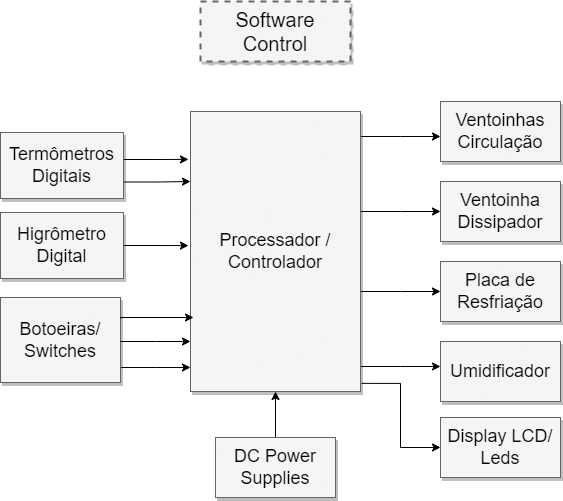
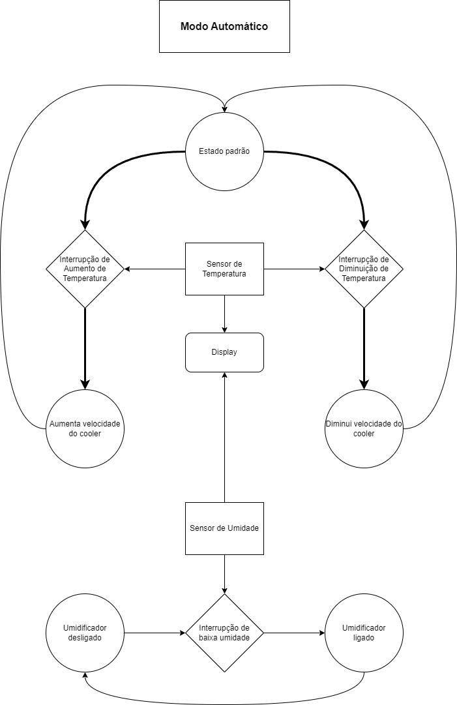
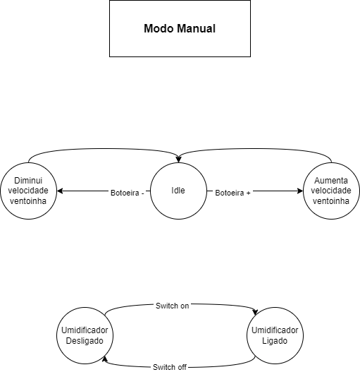

# ` Climatizador Automático `
# ` Auto Acclimatizer `

## Apresentação

O presente projeto foi originado no contexto das atividades da disciplina de graduação *EA075 - Introdução ao Projeto de Sistemas Embarcados*, 
oferecida no segundo semestre de 2023, na Unicamp, sob supervisão da Profa. Dra. Paula Dornhofer Paro Costa, do Departamento de Engenharia de Computação e Automação (DCA) da Faculdade de Engenharia Elétrica e de Computação (FEEC).

|Nome  | RA | Curso|
|--|--|--|
| Aron Simoes Ferreira Maciel  | 261064 | Eng. da Computação|
| Erivelton da Rocha Tavares   | 170645 | Eng. Elétrica|

## Arquivos Importantes

[Esquemático em PDF](./pdf/schematic)

[Lista de Componentes](./components.md)

[PCB](./imagens/PCB.jpg)

## Descrição do Projeto
O Climatizador Automático foi idealizado pensando no conforto das pessoas que aderiram às novas modalidades de trabalho (home office) e estudo (aulas EAD) para que elas possam ter um ambiente agradável tanto em termos de temperatura quanto de umidade.  
O nosso Climatizador se propõe a ser uma solução portátil, ou seja, de encapsulamento razoavelmente pequeno e também ser uma solução mais ecônomica em relação às soluções disponíveis hoje no mercado.

## Descrição Funcional
O Climatizador Automático permitirá ao usuário selecionar se deseja regular manualmente a temperatura e umidade ou realizar um controle automátizado - informando ao sistema o ciclo de temperatura ou umidade desejado. Para tanto haverá um display informando ao usuário a temperatura e umidade atual e botões que lhe permitirão entrar no modo configuração para selecionar o set point desejado (através de incremento/decremento de um valor default) ou criar seu ciclo automático.  
Uma vez definido o modo de operação, um watercooler será acionado para fazer a troca térmica e assim permitir resfriar ou aquecer o ambiente e ventoinhas farão a dissipação do ar. Além disso, um vaporizador/umidificador será acionado periodicamente para manter o ambiente na umidade desejada.

### Funcionalidades
O Climatizador Automático será capaz de controlar o ambiente da maneira que o usuário desejar através de:  
    - Controle de Temperatura Manual  
    - Controle de Temperatura Automático  
    - Controle de Umidade Manual  
    - Controle de Umidade Automático

### Configurabilidade
Será possível escolher entre operação manual e automática.  
  
Modo Manual: O usuário informará ao sistema o set point de temperatura e umidade desejado e o climatizador irá controlar o resfriamento e umidificação para atingir o requisito e permanecerá nessa rotina até que o usuário decida alterar o set point ou desligar o sistema.  
  
Modo Automático: O usuário entrará com pontos de temperatura e umidade que deseja e quanto tempo deve permanecer em cada um e também poderá definir em que momento o sistema deve ser desligado.

### Eventos
O sistema deve tratar os eventos de configuração feitos pelo usuário através do display LCD e dos botões e também os eventos de mudança de condições ambientais atuando assim no sistema de climatização e umidificação. Podemos classificar os eventos em periódicos e não periódicos, sendo eles:  
  
Não-Periódicos:  
    - Ação do usuário (ligar ou desligar e mudar a configuração);  
  
Periódicos:  
    - A cada 1 min realizar a leitura dos sensores de temperatura e umidade e comparar com o set point estabelecido;  
    - Acionar o sistema umidificador para manter a umidade no valor desejado. 
    Obs: A periodicidade deste evento depende da umidade ambiente e da umidade desejada;  
    - Acionar o watercooler e ventoinhas para resfriamento do ambiente.
    Obs: A periodicidade deste evento depende da temperatura ambiente e da temperatura desejada;

### Tratamento de Eventos
O tratamento do controle de temperatura se dará através do controle de velocidade das ventoinhas - o qual será feito através de PWM - a fim de aumentar ou diminuir o fluxo de vento, mantendo assim a temperatura desejada. Além disso, o sistema de watercooler utilizará a água para realizar a troca térmica com o ambiente.  
O tratamento da umidade será feita através do sistema umidificador que terá sua frequência de acionamento condizente com a diferença entre a umidade ambiente e a umidade desejada, ou seja, quanto maior a diferença entre estes parâmetros maior será a frequência de acionamento do sistema.  
Além disso, a cada minuto o display LCD será atualizado com as leituras dos sensores para que o usuário possa saber como está o ambiente.  
Por fim, a ação do usuário que se dará por meio dos botões será tratada via interrupções do processador.

## Descrição Estrutural do Sistema
O sistema será composto pelas seguintes dispositivos: 
- De entrada: 2 Termômetros digitais, um para medir a temperatura de saída do ar, outra pra medir a temperatura na placa térmica, um higrômetro para medir a umidade do ar, botoeiras e/ou switches para configuração do módulo.
- De saída: 2 Ventoinhas de circulação do ar, uma ventoinha de dissipação da placa termica, a placa termica em si, um dispositivo umidificador e displays LCD e/ou Leds para informar as informações de Temperatura e Umidade para o usuário.
- De controle: Um micro-controlador para realizar o controle de todos os dispositivos acoplados.

Abaixo podemos ver um Diagrama em blocos com a descrição estrutural do sistema:

## Especificações

### Especificação Estrutural

O projeto do climatizador automático trabalhará com duas interfaces elétricas: 5 V e 127 V. 
A interface de 5 V foi utilizada para alimentação do sensor de temperatura e umidade, acionamento dos relés responsáveis pelos acionamentos do umidificador de ar e do desumidificador de ar, das ventoinhas de refrigeração, do display e para realizar a leitura dos botões responsáveis pela escolha de modo de operação e controle de setpoint.
A interface de 127 V foi utilizada para alimentar o umidificador de ar e desumidificador de ar que devem ser ligados na rede elétrica. Logo, a interface de 5 V (através do uso de relés) funcionará como driver para ligar/desligar esses periféricos.

Definição dos periféricos:

Sensor de temperatura e umidade: 
Modelo: DHT 11
Tensão de alimentação: Entre 3 V e 5.5 V
Corrente de alimentação: Entre 0.5 mA e 2.5 mA
Protocolo de comunicaão: Interface Serial (Single-Wire Two-Way)
Precisão: 4% para umidade 2 °C para temperatura
Range de detecção: de 0 °C a 50 °C e 20 % a 90 % UR

Display:
Modelo: LCD 16x2 
Tensão de Alimentação: Entre 4.5 V e 5.5 V
Corrente de alimentação: Entre 75 mA  e 200 mA
Protocolo de comunicação: Paralelo de 4 a 8 bits

Ventoinha: 
Potência: 2 W
Tensão de alimentação: 5 V
Corrente de alimentação: 400 mA

Umidificador de Ar:
Tensão de Alimentação: 110 V

Desumidificador de Ar:
Tensão de alimentação: 110 V

O sensor de temperatura e umidade escolhido já vem com conversor A/D embutido e por isso não será necessário o uso de um conversor A/D externo. Do ponto de vista das saídas, as cargas que o sistema controlará são analógicas, contudo, não será necessário um conversor D/A pois a saída digital do microcontrolador irá acionar o driver de controle/potência utilizado para acionar a carga - no caso da ventoinha a saída irá polarizar os transistores de potência que fazem a interface de corrente da ventoinha ou para acionar a bobina do relé que ligará o umidificador de ar e o desumidificador de ar à rede elétrica.

Especificações do Climatizador Automático:
Temperatura de Operação: de 0 °C a 50 °C
Umidade Relativa para operação: de 20 % UR a 90 % UR
Dimensões Físicas: O Climatizador automático fica limitado às dimensões físicas da ventoinha, umidificador e desumidificador de ar utilizados. Podem ser utilizados diferentes modelos desde que atendam às especificações citadas acima. Assim sendo, é necessário uma mesa que comporte estes periféricos e que se tenha disponível uma tomada com 110 V para o umidificador de ar e desumidificador de ar.

### Especificação de Algoritmos

O Algoritmo irá contemplar dois modos de funcionamento, um modo automatico e um modo manual. No modo automático, um preset de temperatura e umidade será seguido, ajustando a velocidade da ventoinha pra manter sempre a temperatura dentro de uma faixa e umidade acima de um valor dado pelo usuário previamente, ambos os valores de temperatura e umidade medidos são mostrados a todo tempo no display. 

Nesse modo haverão os seguintes eventos: 
- Temperatura normal: O sensor de temperatura está registrando temperaturas dentro do limiar especificado, sendo assim, o programa deve executar seu estado padrão
- Temperatura elevada: O sensor de temperatura está registrando temperaturas acima do limiar especificado sendo assim, o programa deve executar seu estado 'Diminuir velocidade do cooler'
- Temperatura baixa: O sensor de temperatura está registrando temperaturas abaixo do limiar especificado sendo assim, o programa deve executar seu estado 'Aumentar velocidade do cooler'
- Umidade normal: O sensor de umidade está registrando umidade acima do limite minimo, sendo assim, o programa deve estar no modo 'Umidificador desligado'
- Umidade baixa: O sensor de umidade está registrando umidade abaixo do limite minimo, sendo assim, o programa deve estar no modo 'Umidificador ligado' 

Já no modo manual, o usuário poderá controlar a velocidade da ventoinha pro valor que quiser, assim como o status de funcionamento do umidificador.

Nesse modo haverão os seguintes eventos: 

- Idle: O usuário não realizou nenhuma interrupção
- Baixar Temperatura: O usuário acionou a botoeira para aumento da velocidade
- Aumentar Temperatura: O usuário acionou a botoeira para diminuir a velocidade
- Aumentar Umidade: O usuário acionou o switch de ativação do umidificador
- Abaixar Umidade: O usuário desligou o switch de ativação do umidificador

## Referências
Sensor de Temperatura e Umidade:
https://html.alldatasheet.com/html-pdf/1440068/ETC/DHT11/60/1/DHT11.html

Controle de umidificador de ar:
https://www.youtube.com/watch?v=ppVheVtNlcc

controle de temperatura:
https://www.youtube.com/watch?v=AbpNE_0faU0

display:
https://www.arducore.com.br/display-lcd-16x2-c-blacklight

BC548:
    

TIP122: 
https://html.alldatasheet.com/html-pdf/5764/MOTOROLA/TIP122/257/1/TIP122.html

