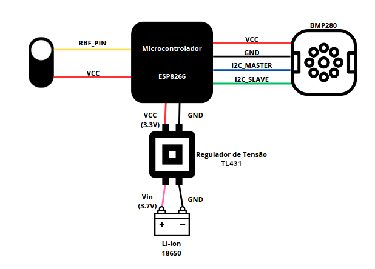

# `Caixa Preta`
# `Black Box`

## Apresentação
O presente projeto foi originado no contexto das atividades da disciplina de graduação *EA075 - Introdução ao Projeto de Sistemas Embarcados*, 
oferecida no segundo semestre de 2023, na Unicamp, sob supervisão da Profa. Dra. Paula Dornhofer Paro Costa, do Departamento de Engenharia de Computação e Automação (DCA) da Faculdade de Engenharia Elétrica e de Computação (FEEC).

|Nome  | RA | Curso|
|--|--|--|
| Caio Ruiz Coldebella  | 232621  | Eng. de Computação|
| Gustavo de Souza dos Reis  | 217425  | Eng. de Computação|

## Arquivos Importantes
- [Esquemático](./pdf/esquematico.pdf)
- [Lista de Componentes](./components.md)
- [PCB](./images/circuito.jpeg)

## Descrição do Projeto
O Black Box é um sistema de registro e transmissão de dados de vôo de um foguete, ele foi pensado para
atender uma demanda da equipe Antares Unicamp, aonde se viu a necessidade de análise de informações do lançamento.

Dessa forma, mesmo que haja um acidente que comprometa o vôo, o sistema deve ser seguro e resistente o suficiente para
resistir ao impacto da queda e permitir a leitura de informações via rede WiFi sobre o lançamento ao ser encontrado em terra, além disso
é necessário que seja de baixo custo.

## Descrição Funcional
O sistema será projetado utilizando uma plataforma de IOT Wemos D1 Mini Pro baseada no microcontrolador ESP8266, juntamente com um barômetro BMP280, funcionando como altímetro,
que será responsável por fornecer com precisão os dados de altitude. 

A vantagem de utilizarmos o ESP8266 é que este possui uma memória EEPROM de 4MB, além de uma flash de 32MB, nas quais podemos salvar os dados do sensor de forma segura. Tem também um  módulo wi-fi para podermos receber com praticidade os dados de log do vôo. Além disso ele possui outros pontos positivos como bluetooth, um microprocessador de baixa potência,
 antena embutida, conversor USB serial integrado e porta micro USB para alimentação e programação. Inicialmente foi planejado utilizar a placa NodeMCU Amica, porém verificamos que a plataforma Wemos D1 Mini Pro atendia aos requisitos de tamanho e consumo de energia de maneira mais adequada.

### Funcionalidades
As funcionalidades planejadas para o sistema serão:

- Detecção de Apogeu (altitude máxima de vôo)
- Tempo de Apogeu
- Variação da altitude ao longo de intervalos de tempo
- Tranmissão de dados via WiFi e visualização no navegador web.

### Configurabilidade
Os modos de funcionamento do sistema serão configurados por meio de um switch RBF (Remove Before Flight).

- Se o RBF estiver inserido no sistema, estaremos com o modo de leitura ativado, sendo possível ler os dados do último vôo via wifi
- Se o RBF for removido, estaremos no modo escrita, no qual o microcontrolador salva os dados lidos pelo altímetro, com destaque para o apogeu.

### Eventos
- Inserção do RBF
	- Comunicação via wi-fi (não periódico)

- Remoção do RBF
	- Leitura do altímetro (periódico, ~50ms)
	- Registro de leitura do altímetro (periódico, ~250ms)

### Tratamento de Eventos
- Inserção do RBF: ao inserir o RBF, o sistema deve parar de escrever os dados na memória, habilitar o web-server e a interface wifi e disponibilizar os dados lidos na interface.
- Remoção do RBF: ao remover o RBF, o sistema deve coletar as leituras do altímetro, filtrá-las (média móvel) e salvar na memória EEPROM.

## Descrição Estrutural do Sistema

## Especificações

### Especificação Estrutural
A ideia é comunicar o módulo BMP280 com o ESP8266 via I2C, pois ambos os dispositivos fornecem essa interface. Como vamos fazer uma leitura a cada 50ms, não é necessário um protocolo mais veloz, que seria o caso do SPI, além de que o I2C necessita de menos conexões. Além disso, o BMP280 possui uma acuracia de $\pm 0.12hPa (1m)$ e implementa um filtro IIR, que pode ser configurado via Software. Sua tensão de operação é de 1.8V a 3.6V, sendo a saída de 3.3V do microcontrolador suficiente para alimentação, e seu consumo de corrente em operação é de $2.7 \mu A$.
O Switch RBF será um sistema de jumper conectado a uma interface apropriada disponibilizada. Essa interface conta com dois pinos, sendo um deles o VCC e outro uma GPIO do microcontrolador. Quando o RBF estiver inserido, o pino estará conectado ao VCC. Quando estiver removido, o pino estará conectado ao GND por meio de um sistema de pull-down.
Além disso, a alimentação de todo o sistema será feita utilizando uma bateria Li-Ion 18650 de 3.7V ligada à um regulador de tensão (TL431) que fornecerá 3.3V ao microcontrolador. Essa bateria possui uma carga de 2500mAh, o que, considerando um consumo típico do ESP8266 de 70mA, é suficiente para aproximadamente 28 horas de operação. 

Como trata-se de um sistema que estará embarcado em um foguete, suas dimensões devem, idealmente, seguir o padrão definido para um *Cansat* de 115mm de altura e 66mm de largura e também deve ser resistente a fortes vibrações e grandes acelerações. Além disso, o dispositivo não pode ser completamente vedado, pois o BMP280 precisa ler a variação de pressão externa para inferir a altitude, e a interface do RBF deve ficar disponivel externamente, para fazer rapidamente a inserção ou remoção do dispositivo. Por fim, não podem haver materiais que bloqueiem sinais de RF, pois a comunicação em solo será feita por meio de Wi-Fi. Por essas razões, será projetada uma estrutura em 3D que acomode de forma segura o dispositivo e cumpra todos os requisitos colocados  
### Especificação de Algoritmos

[Pseudocódigo de especificação do algoritmo](./pdf/Especificacao_algoritmos.pdf)

Para realizar a estimativa do tamanho que o código irá ocupar na memória, utilizamos o auxílio do ChatGPT para analisar o pseudocódigo, já que não temos como realizar a sua compilação. Para isso foram levados em conta os seguintes fatores:

1. *Inclusão de Bibliotecas*: A inclusão de bibliotecas específicas para o ESP8266.

2. *Código de Configuração*: Funções como `setup()` e `loop()` que possuem pouca complexidade.

3. *Funções Adicionais*: As funções adicionais, como `setup_provide_data()`, `setup_flight()`, `provide_flight_data()`, `read_flight_data()`, `handle_OnConnect()`, e `handle_NotFound()`.

4. *Operações de I2C e EEPROM*: Operações de leitura/gravação na EEPROM e comunicação I2C podem adicionar código extra, mas o tamanho exato depende da implementação específica dessas operações.

5. *Manipulação de Variáveis e Controle de Fluxo*: O código que lida com variáveis, estruturas de controle de fluxo e lógica condicional também contribuirá para o tamanho do código.

Dado esse conjunto de fatores e com a premissa de que o código não é excessivamente complexo e não inclui bibliotecas extremamente grandes, a estimativa de 20 KB a 50 KB parece uma faixa razoável.

## Referências

- [Descrição ESP8266](https://www.huinfinito.com.br/home/1145-modulo-wifi-esp8266-nodemcu-esp-12e.html)
- [Usando a EEPROM ESP8266](https://www.aranacorp.com/pt/usar-a-eeprom-com-um-esp8266/)
- [Seven Pro Tips for ESP8266](https://www.instructables.com/ESP8266-Pro-Tips/)
- [Datasheet BMP280](./datasheets/BST-BMP280-DS001-11.pdf)
- [LiIon 18650 datasheet](./datasheets/SAMSUNG%20INR18650-25R.pdf)
- [TL431 datasheet](./datasheets/tl431.pdf)
- [Dimensões Cansat](https://www.esa.int/SPECIALS/CanSat/SEM6JVCKP6G_0.html)

