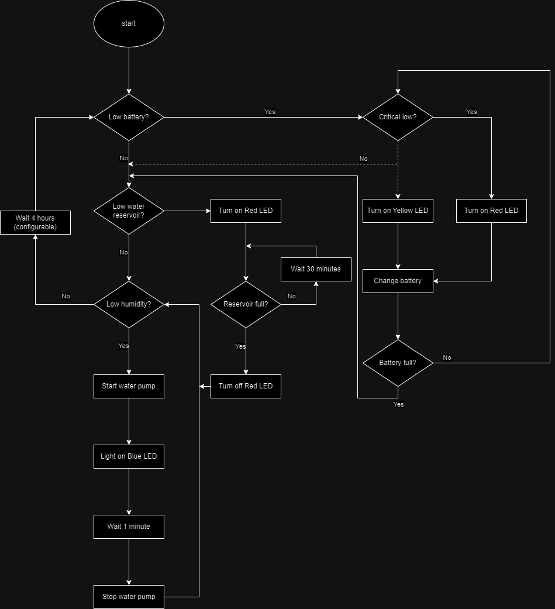

# `Regador de Planta Automático`
# `Automatic Plant Watering System`

## Apresentação

O presente projeto foi originado no contexto das atividades da disciplina de graduação *EA075 - Introdução ao Projeto de Sistemas Embarcados*, 
oferecida no segundo semestre de 2023, na Unicamp, sob supervisão da Profa. Dra. Paula Dornhofer Paro Costa, do Departamento de Engenharia de Computação e Automação (DCA) da Faculdade de Engenharia Elétrica e de Computação (FEEC).

|Nome  | RA | Curso|
|--|--|--|
| Chen Jiahao  | 195673  | Eng. Elétrica|
| Victor Loiola Lima  | 257028  | Eng. Elétrica|

## Descrição do Projeto
O objetivo principal do projeto é criar um sistema que possa irrigar a terra de plantas de forma automática. Este sistema é voltado para usuários amadores em jardinagem, que procuram uma solução barata e portátil para regar suas plantas quando necessário.
Como o cuidado de plantas é constante e pode ocorrer o esquecimento em fazê-lo, esse sistema propõe regá-las através de uma rotina elaborada com ações definidas para cada cenário onde a planta e o ambiente se encontram.
Apenas uma atividade manual continuará sendo necessária: Preencher o reservatório com água, justamente por ser portátil e oferecer ao usuário que utilize o sistema em qualquer lugar de seu estabelecimento.
Não será necessário recarregar as baterias pois elas serão recarregadas pela luz solar.
Valor econômico estimado associado ao projeto:

 - Micro controlador ATMega328: R$20
 - Mini bomba d'água: R$20
 - Painel para recarregar bateria através de luz solar: R$30
 - Tubo para regar plantas: R$5
 - Impressão da placa PCB: R$10
 - Componentes da placa: R$10
 - Sensor de nível d'água: R$20

## Descrição Funcional

### Funcionalidades

 - Regar a planta. Quando o sistema julgar necessário, através do sensor de umidade e da contagem de tempo desde a última ação de regar a planta;
 - Recarregar bateria. Quando detectar bateria fraca, recarrega a mesma através de painel solar.

### Configurabilidade

 - O usuário pode escolher de quanto em quanto tempo o sistema verifica a umidade das plantas. Por default, é estabelecido um intervalo de 4 horas;
 - Por ser portátil, o sistema pode ser colocado em qualquer local do estabelecimento onde o usuário julgue que fique bom esteticamente, adaptando aos móveis;
 - O usuário pode escolher o tamanho do reservatório de água pois ele pode ser qualquer utensílio doméstico, por exemplo: Pote, garrafa d'água, balde, etc (desde que fechado e higienizado).

### Eventos
|Periódicos (Padrão de 4 horas ou definido pelo usuário) | Não-periódicos (Dependem dos eventos periódicos)|
|--|--|
| Umidade baixa| Acionamento do painel solar  |
|Reservatório baixo |Acionamento da bomba de água|
|Status da bateria|-|

### Tratamento de Eventos
O sistema irá tratar os eventos de acordo com o estado da máquina naquele momento. Por exemplo caso a máquina esteja no estado inicial ele irá seguir com a rotina de checagem antes de entrar na etapa de irrigação, isto é irá verificar se: a)Bateria baixa, b) Reservatório baixo, c)Umidade baixa e d)Acionamento da bomba.

 - a)Bateria baixa: o sistema irá verificar o nível da bateria e decidir se está em estado crítico ou não para acionar a recarga pelo painel solar. 
Em estado crítico será acionado um LED vermelho para alertar o usuário e irá manter o estado atual até recarregar a bateria em nível não crítico. 
Caso o estado não seja crítico, será acionado a recarga da bateria pelo painel solar e permitirá o processamento em paralelo do restante do sistema.
A checagem da bateria é realizada a cada 10 minutos
- b)Reservatório baixo: Abaixo de certo nível de água no reservatório o programa acionará o LED vermelho de alerta e manterá o problema em loop até que o reservatório seja preenchido. Com checagem de nível a cada 30 minutos.
- c)Umidade baixa: O sensor irá retornar a umidade da terra, abaixo de certo nível irá acionar a bomba de água para regar a planta, caso a umidade esteja alta, após um tempo de 4 horas por padrão (configurável pelo usuário) ele irá retornar ao estado inicial e passando por cada checagem novamente.
- d)Acionamento da bomba: Após a leitura da umidade, através do evento de umidade baixa a bomba será acionada e irá bombear água para a planta e após 1 minuto contado pelo microcontrolador, a bomba irá desligar. Um LED azul estará aceso enquanto a bomba estiver em funcionamento.

## Descrição Estrutural do Sistema

## Referências

https://grupolenotre.com/post/qual-o-melhor-horario-para-regar-o-seu-jardim

https://www.amazon.com/ALAMSCN-Submersible-Aquariums-Fountain-Hydroponics/dp/B08PBQ1N1G/ref=sr_1_5?keywords=5v+water+pump&qid=1694209040&sr=8-5

https://footprinthero.com/how-to-solar-power-an-arduino

https://www.digikey.com/en/resources/conversion-calculators/conversion-calculator-battery-life

https://curtocircuito.com.br/blog/Categoria%20Arduino/como-usar-um-sensor-de-nivel-de-agua
